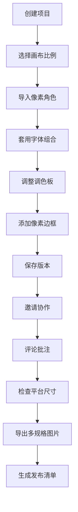

## 1. 产品概述

PixelForge 是面向独立游戏开发者的像素风创意设计平台，专注于游戏宣传物料的一站式制作工具。

- 核心价值：让开发者无需专业设计技能，即可快速制作符合像素美学的游戏宣传素材
- 目标用户：独立游戏开发者、像素艺术爱好者、小型游戏工作室
- 解决问题：降低游戏宣传物料制作门槛，统一品牌视觉，提高发布效率

## 2. 核心功能

### 2.1 用户角色

| 角色 | 注册方式 | 核心权限 |
|------|----------|----------|
| 独立开发者 | 邮箱/第三方登录 | 完整功能使用、项目管理、导出下载 |
| 协作者 | 邀请链接 | 评论批注、版本查看、编辑权限 |

### 2.2 功能模块

1. **项目首页**：项目概览、最近项目、快速模板、团队动态
2. **素材库**：像素角色库、背景素材、边框装饰、字体组合
3. **海报编辑**：画布比例选择、图层管理、文字编辑、滤镜效果
4. **角色展示**：角色卡生成、动作展示、多视图编排
5. **动图生成**：帧动画编辑、时间轴控制、导出设置
6. **品牌套件**：调色板管理、Logo 变体、品牌规范
7. **导出中心**：多规格导出、平台尺寸检查、发布清单生成

### 2.3 页面详情

| 页面名称 | 模块名称 | 功能描述 |
|----------|----------|----------|
| 项目首页 | 项目仪表盘 | 项目卡片展示、创建新项目、最近编辑项目、快速模板入口 |
| 项目首页 | 团队协作区 | 邀请协作者、评论通知、版本历史 |
| 素材库 | 素材分类 | 角色/背景/边框/字体分类浏览、搜索筛选、收藏管理 |
| 素材库 | 上传管理 | 本地上传像素图、素材预览、素材详情 |
| 海报编辑 | 画布设置 | 画布比例选择（16:9/1:1/9:16/4:3等）、像素网格、对齐辅助 |
| 海报编辑 | 元素编辑 | 拖拽定位、缩放旋转、图层顺序、像素边框添加 |
| 海报编辑 | 文字工具 | 字体组合套用、像素文字、文字样式 |
| 海报编辑 | 商店封面 | Steam/Epic 商店封面模板、尺寸自动适配 |
| 海报编辑 | 截图墙 | 多图编排、自动布局、批量替换文案 |
| 角色展示 | 角色卡 | 角色信息编辑、属性展示、多姿态排列 |
| 角色展示 | 动作展示 | 待机/行走/攻击动画预览 |
| 动图生成 | 帧编辑器 | 帧序列管理、帧时长设置、循环模式 |
| 动图生成 | 动图预览 | 实时预览、速度调节、洋葱皮模式 |
| 品牌套件 | 调色板 | 颜色调整、预设调色板、批量替换 |
| 品牌套件 | Logo 管理 | Logo 变体、应用预览 |
| 导出中心 | 多规格导出 | PNG/JPG/GIF/MP4 多格式、多尺寸批量导出 |
| 导出中心 | 平台检查 | Steam/Epic/推特/微博平台尺寸检查、分辨率检查 |
| 导出中心 | 发布清单 | 生成发布清单、版本管理、协作分享 |

## 3. 核心流程

用户创建项目 → 选择模板或从零开始 → 添加素材 → 编辑设计 → 调整样式 → 版本保存 → 邀请协作 → 评论批注 → 导出素材 → 生成清单 → 发布应用

## 4. 界面设计

### 4.1 设计风格

- **主色调**：深紫 (#2D1B4E) 背景 + 霓虹粉 (#FF6B9D) 强调 + 像素青 (#64FFDA) 高亮
- **辅助色**：复古黄 (#FFE66D)、像素橙 (#FF8C42)
- **按钮风格**：像素化边框、悬停霓虹发光效果、按下凹陷效果
- **字体**：Press Start 2P（标题）+ VT323（正文）+ Zpix（中文像素字体）
- **布局风格**：像素网格背景、粗边框卡片、复古 CRT 扫描线效果
- **图标风格**：8-bit 像素图标、霓虹发光效果

### 4.2 页面设计概览

| 页面名称 | 模块名称 | UI 元素 |
|----------|----------|----------|
| 项目首页 | Hero 区域 | 像素化 Logo、霓虹渐变背景、扫描线动画、像素按钮 |
| 项目首页 | 项目卡片 | 悬浮发光边框、像素缩略图、悬停抖动动画 |
| 素材库 | 素材网格 | 像素卡片、悬停放大、发光选中状态 |
| 海报编辑 | 画布区域 | 像素网格、十字准星、对齐辅助线 |
| 海报编辑 | 工具栏 | 像素图标按钮、工具分组、激活高亮 |
| 角色展示 | 角色卡 | 复古游戏卡带风格、属性条动画 |
| 动图生成 | 时间轴 | 像素帧缩略图、播放控制、帧间隔滑块 |
| 品牌套件 | 调色板 | 像素色块、拖拽排序、霓虹光晕 |
| 导出中心 | 导出列表 | 平台图标、尺寸标签、进度条 |

### 4.3 响应式设计

- 桌面端优先设计，自适应平板和移动设备
- 工具栏在移动端转为底部抽屉
- 画布区域响应式缩放保持比例
- 触控优化：增大点击区域、手势缩放支持

### 4.4 动效设计

- 页面加载：像素化渐入、扫描线扫过效果
- 按钮交互：悬停霓虹发光、按下像素抖动
- 拖拽操作：像素半透明预览、吸附对齐反馈
- 画布操作：像素网格动画、选中元素呼吸效果
- 导出过程：进度条像素动画、完成庆祝动效
