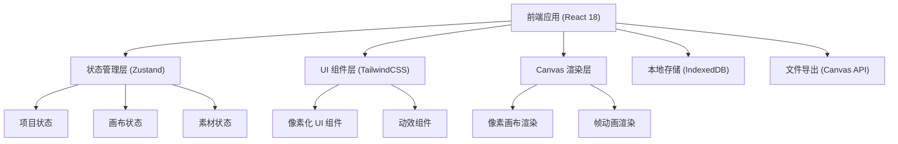

## 1. 架构设计



## 2. 技术描述

- **前端框架**: React 18 + TypeScript
- **构建工具**: Vite 5
- **样式方案**: TailwindCSS 3.4
- **状态管理**: Zustand
- **路由**: React Router v6
- **图标**: Lucide React（像素化处理）
- **图像处理**: Canvas API + html2canvas
- **动效**: Framer Motion
- **数据存储**: LocalStorage + IndexedDB
- **后端**: 无（纯前端应用，数据存储在本地）

## 3. 目录结构

```
src/
├── components/          # 共享组件
│   ├── layout/         # 布局组件（导航、侧边栏）
│   ├── ui/             # UI 基类组件（按钮、卡片、输入框）
│   ├── canvas/         # 画布相关组件
│   └── pixel/          # 像素化专用组件
├── pages/              # 页面组件
│   ├── Home/           # 项目首页
│   ├── Library/        # 素材库
│   ├── Poster/         # 海报编辑
│   ├── Character/      # 角色展示
│   ├── Animation/      # 动图生成
│   ├── Brand/          # 品牌套件
│   └── Export/         # 导出中心
├── store/              # Zustand 状态管理
│   ├── projectStore.ts
│   ├── canvasStore.ts
│   └── libraryStore.ts
├── hooks/              # 自定义 Hooks
│   ├── useCanvas.ts
│   ├── usePixel.ts
│   └── useAnimation.ts
├── utils/              # 工具函数
│   ├── pixel.ts        # 像素处理工具
│   ├── export.ts       # 导出工具
│   └── color.ts        # 颜色处理
├── types/              # TypeScript 类型定义
│   ├── project.ts
│   ├── canvas.ts
│   └── assets.ts
├── data/               # Mock 数据
│   ├── templates.ts
│   ├── assets.ts
│   └── palettes.ts
├── App.tsx
├── main.tsx
└── index.css
```

## 4. 路由定义

| 路由 | 页面 | 说明 |
|------|------|------|
| `/` | 项目首页 | 项目仪表盘、最近项目、模板入口 |
| `/library` | 素材库 | 素材浏览、搜索、上传管理 |
| `/poster/:id` | 海报编辑 | 画布编辑、图层管理、商店封面 |
| `/character/:id` | 角色展示 | 角色卡生成、动作展示 |
| `/animation/:id` | 动图生成 | 帧动画编辑、时间轴控制 |
| `/brand/:id` | 品牌套件 | 调色板、Logo 管理 |
| `/export/:id` | 导出中心 | 多规格导出、平台检查 |

## 5. 核心状态管理

### 5.1 项目状态 (projectStore)

```typescript
interface Project {
  id: string;
  name: string;
  thumbnail: string;
  createdAt: number;
  updatedAt: number;
  versions: Version[];
  collaborators: Collaborator[];
  comments: Comment[];
}

interface Version {
  id: string;
  name: string;
  snapshot: string;
  createdAt: number;
  author: string;
}

interface Comment {
  id: string;
  content: string;
  position: { x: number; y: number };
  author: string;
  createdAt: number;
  resolved: boolean;
}
```

### 5.2 画布状态 (canvasStore)

```typescript
interface CanvasElement {
  id: string;
  type: 'image' | 'text' | 'shape' | 'border';
  x: number;
  y: number;
  width: number;
  height: number;
  rotation: number;
  layer: number;
  visible: boolean;
  locked: boolean;
  data: any;
}

interface CanvasState {
  width: number;
  height: number;
  ratio: string;
  pixelSize: number;
  zoom: number;
  gridVisible: boolean;
  elements: CanvasElement[];
  selectedId: string | null;
  palette: ColorPalette;
}
```

### 5.3 素材状态 (libraryStore)

```typescript
interface Asset {
  id: string;
  type: 'character' | 'background' | 'border' | 'font';
  name: string;
  thumbnail: string;
  url: string;
  tags: string[];
  favorite: boolean;
  palette?: string[];
}
```

## 6. 数据模型

### 6.1 Mock 数据结构

```typescript
// 预设画布比例
const CANVAS_RATIOS = [
  { id: '16:9', name: '横版 16:9', width: 1920, height: 1080 },
  { id: '1:1', name: '正方形 1:1', width: 1080, height: 1080 },
  { id: '9:16', name: '竖版 9:16', width: 1080, height: 1920 },
  { id: '4:3', name: '标准 4:3', width: 1600, height: 1200 },
  { id: 'steam', name: 'Steam 封面', width: 460, height: 215 },
  { id: 'epic', name: 'Epic 商店图', width: 1200, height: 1600 },
];

// 预设调色板
const PRESET_PALETTES = [
  {
    id: 'retro',
    name: '复古霓虹',
    colors: ['#FF6B9D', '#64FFDA', '#FFE66D', '#FF8C42', '#2D1B4E']
  },
  {
    id: 'forest',
    name: '像素森林',
    colors: ['#7CB342', '#33691E', '#8D6E63', '#FFD54F', '#1B5E20']
  },
  {
    id: 'ocean',
    name: '深海探险',
    colors: ['#00BCD4', '#01579B', '#006064', '#4FC3F7', '#E1F5FE']
  }
];

// 平台尺寸规范
const PLATFORM_SPECS = [
  { platform: 'Steam', type: '主图', width: 460, height: 215, required: true },
  { platform: 'Steam', type: '背景图', width: 1920, height: 620, required: true },
  { platform: 'Epic', type: '封面图', width: 1200, height: 1600, required: true },
  { platform: 'Twitter', type: '推文图', width: 1200, height: 675, required: false },
  { platform: '微博', type: '配图', width: 1080, height: 1080, required: false },
];
```
